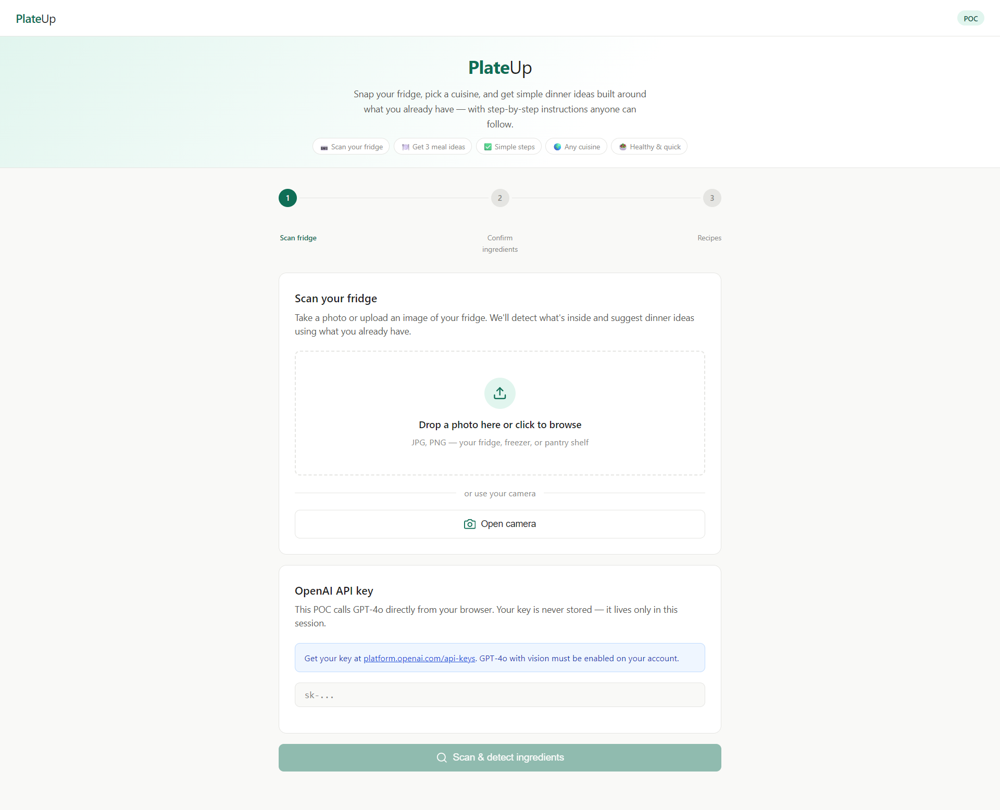
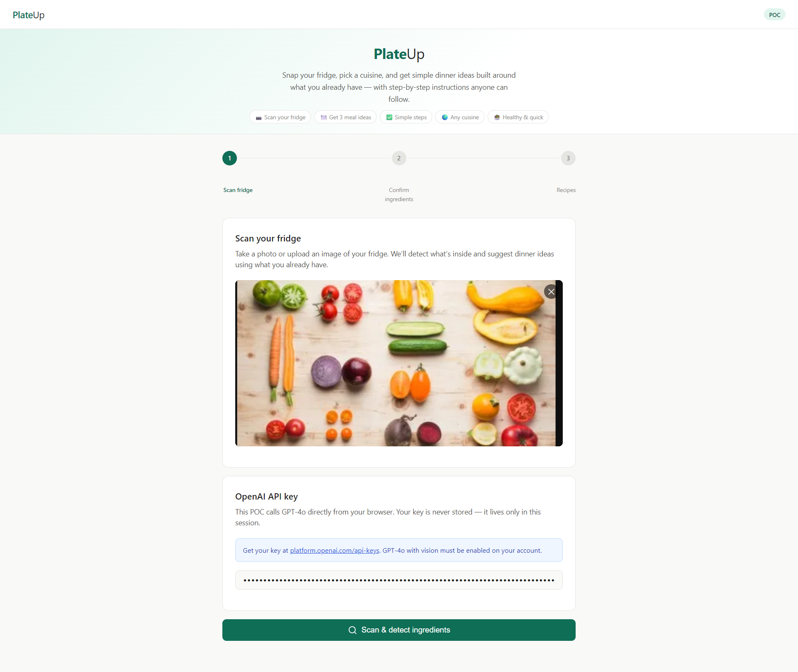
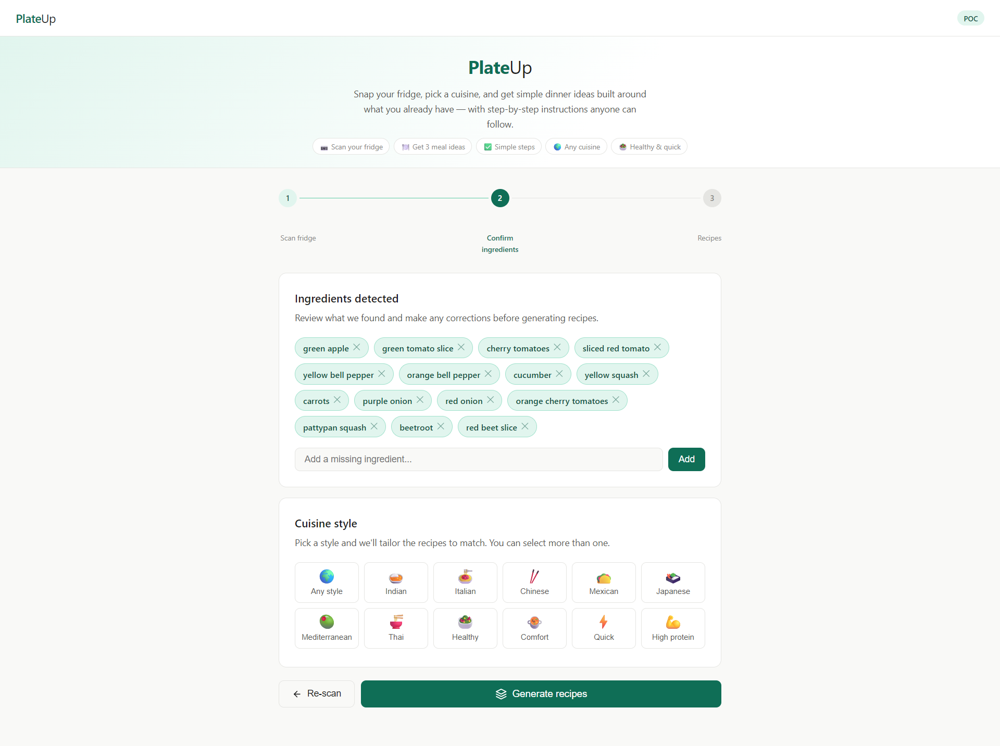
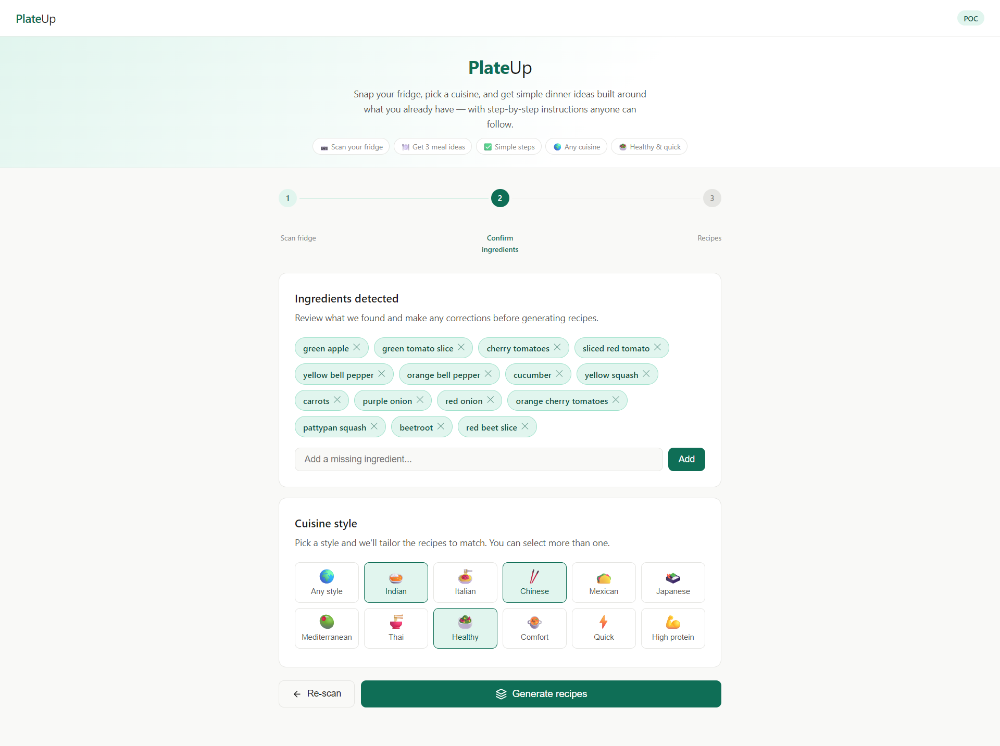
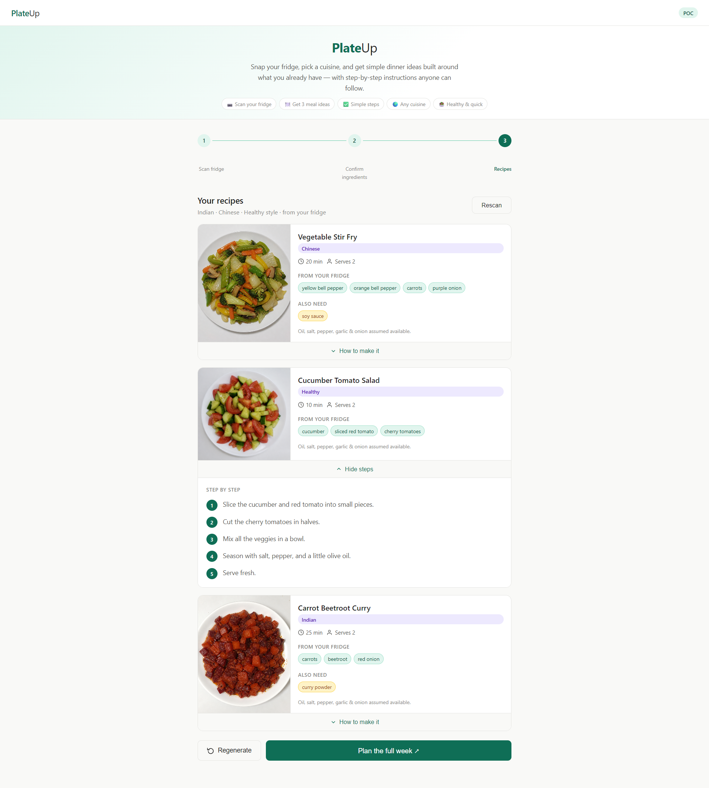

# PlateUp — Fridge to Meal Planner

Snap your fridge, pick a cuisine, and get simple dinner ideas built around what you already have — with step-by-step instructions anyone can follow.

> **POC** · Runs entirely in your browser · No backend · No data stored

---

## Preview

<table>
<tr>
<td width="50%"></td>
<td width="50%"></td>
</tr>
<tr>
<td align="center"><sub>Step 1 — Scan your fridge</sub></td>
<td align="center"><sub>Step 1 — Enter your API key</sub></td>
</tr>
<tr>
<td width="50%"></td>
<td width="50%"></td>
</tr>
<tr>
<td align="center"><sub>Step 2 — Confirm ingredients</sub></td>
<td align="center"><sub>Step 2 — Pick a cuisine</sub></td>
</tr>
<tr>
<td width="50%"></td>
<td width="50%"></td>
</tr>
<tr>
<td align="center"><sub>Step 3 — Recipe suggestions</sub></td>
<td></td>
</tr>
</table>

---

## What it does

PlateUp uses GPT-4o vision to scan your fridge photo, identify the ingredients, and generate 3 personalised dinner recipes you can cook tonight — complete with AI-generated dish photos and beginner-friendly step-by-step instructions.

---

## Features

- **Fridge scanning** — upload a photo or open your camera directly in the browser
- **Drag & drop** — drop an image straight onto the upload zone
- **Ingredient review** — see every detected ingredient as a tag; remove wrong ones or add missing ones
- **Cuisine picker** — choose from 12 styles (Indian, Italian, Chinese, Japanese, Mexican, Mediterranean, Thai, Healthy, Comfort, Quick, High Protein, or Any)
- **3 recipe suggestions** — well-known, practical weeknight dishes matched to what you have
- **AI dish photos** — generated via gpt-image-2 for each recipe
- **Step-by-step instructions** — simple everyday language, max 5 steps, expandable per recipe
- **Regenerate** — don't like the results? Hit regenerate for a fresh set

---

## Prerequisites

You need an **OpenAI API key** with access to:
- `gpt-4o` (for image analysis and recipe generation)
- `gpt-image-2` (for dish photo generation)

Get your key at [platform.openai.com/api-keys](https://platform.openai.com/api-keys).

> Your API key is never stored — it lives only in your browser session and is sent directly to OpenAI.

---

## How to run

No install, no build step. Just open the file:

```
index.html
```

Open it in any modern browser (Chrome, Firefox, Edge, Safari). That's it.

Or serve it locally if you prefer:

```bash
# Python
python -m http.server 8080

# Node
npx serve .
```

Then visit `http://localhost:8080`.

---

## How to use

### Step 1 — Scan your fridge


Open `index.html` in your browser. You'll land on the **Scan your fridge** screen.

You have two options to add a photo:

**Option A — Upload a file**
1. Click inside the dashed upload zone (or drag and drop an image onto it)
2. Select a JPG or PNG photo of your fridge, freezer, or pantry shelf
3. A preview of your photo will appear

**Option B — Use your camera**
1. Click **Open camera**
2. Allow camera access when your browser asks
3. Point your camera at your fridge
4. Click **Capture photo**

Once a photo is loaded you can remove it with the ✕ button and start over.

---

### Step 1b — Enter your API key


Scroll down to the **OpenAI API key** card and paste your key (starts with `sk-`).

The **Scan & detect ingredients** button activates only once both a photo and a valid key are present.

---

### Step 2 — Confirm ingredients


After clicking **Scan & detect ingredients**, GPT-4o analyses your photo. When it finishes you'll see all detected ingredients as teal tags.

**To remove a wrong ingredient** — click the ✕ on any tag.

**To add a missing ingredient** — type it in the field at the bottom and click **Add** (or press Enter).


Below the ingredients, pick a **cuisine style**. You can select more than one, or leave it on **Any style**.

| Option | Description |
|---|---|
| 🌍 Any style | No preference — GPT picks what fits best |
| 🍛 Indian | Curries, dals, biryanis |
| 🍝 Italian | Pasta, risotto, simple sauces |
| 🥢 Chinese | Stir fries, fried rice, noodles |
| 🌮 Mexican | Tacos, burritos, beans |
| 🍱 Japanese | Rice bowls, miso, teriyaki |
| 🫒 Mediterranean | Grilled veg, hummus, olive oil dishes |
| 🍜 Thai | Curries, pad dishes, rice |
| 🥗 Healthy | Light, nutritious, low-oil |
| 🍲 Comfort | Hearty, warming classics |
| ⚡ Quick | 15 minutes or under |
| 💪 High protein | Protein-forward meals |

Click **Generate recipes** when you're ready, or **Re-scan** to go back.

---

### Step 3 — Your recipes


You'll get **3 recipe cards**, each showing:

- An AI-generated dish photo (loads a few seconds after the card appears)
- Recipe name and cuisine tag
- Cook time and number of servings
- **From your fridge** — the ingredients from your scan that the recipe uses (green chips)
- **Also need** — any 1–2 specific items the dish can't do without (amber chips); oil, salt, pepper, garlic and onion are always assumed available

Click **How to make it** on any card to expand the step-by-step cooking instructions. Click again to collapse.

**Actions at the bottom:**
- **Regenerate** — call the API again for a completely different set of recipes
- **Plan the full week ↗** — placeholder button for the next phase of the product

---

## Step indicator

The three-dot progress bar at the top of the page tracks where you are:

```
● ——— ○ ——— ○
Scan    Confirm   Recipes
```

Completed steps turn light teal; the active step is solid teal.

---

## Tech stack

| Layer | What's used |
|---|---|
| UI | Vanilla HTML, CSS, JavaScript — zero dependencies |
| AI vision | OpenAI `gpt-4o` (image + text) |
| Recipe generation | OpenAI `gpt-4o` (text) |
| Dish photos | OpenAI `gpt-image-2` |
| Camera | Browser `MediaDevices.getUserMedia` API |
| File reading | Browser `FileReader` API |

---

## Adding screenshots

Place your screenshots in a `screenshots/` folder at the root of the project:

```
plateup-ai/
├── index.html
├── README.md
└── screenshots/
    ├── step1-scan.png
    ├── step1-apikey.png
    ├── step2-ingredients.png
    ├── step2-cuisine.png
    └── step3-recipes.png
```

Capture them by opening `index.html` in a browser and using your OS screenshot tool or the browser's built-in screenshot (DevTools → device toolbar → screenshot icon in Chrome).

---

## Limitations

- Requires a paid OpenAI account with GPT-4o and image generation enabled
- Image generation cost: each dish photo is a separate `gpt-image-2` call (quality: low)
- No offline mode — all AI calls go to `api.openai.com`
- Mobile camera capture depends on browser permissions; file upload works everywhere
